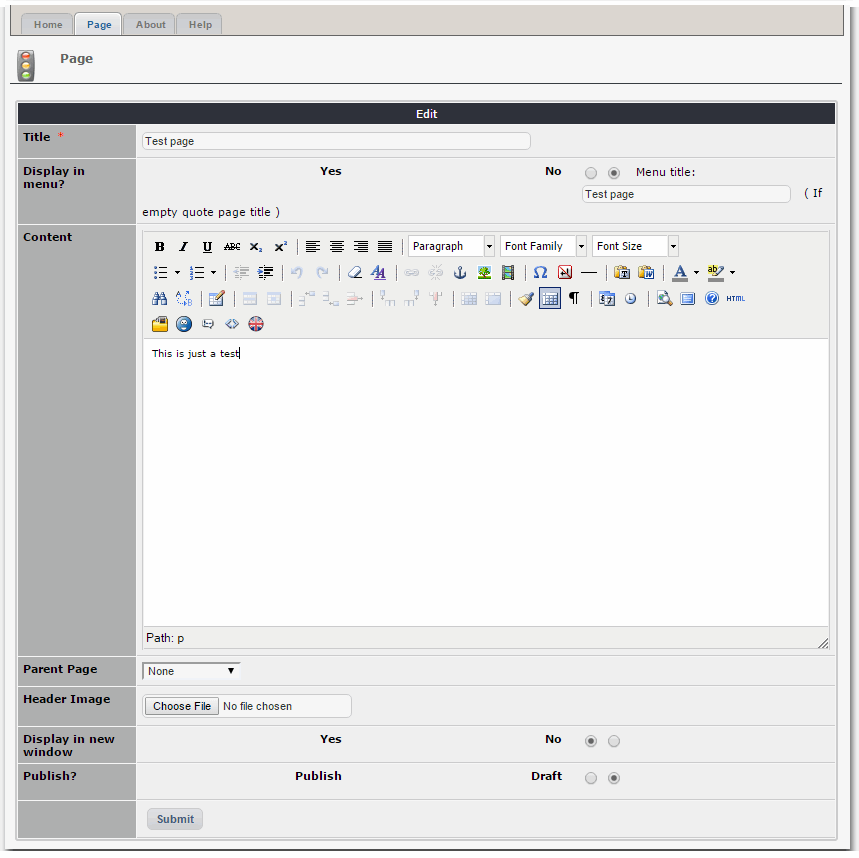
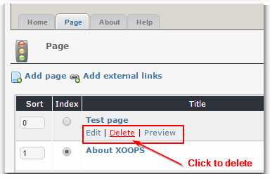

# 4.0 Operating Instructions

##4.1 Admin Home

When we visit the home page of the module management section, you can add, modify "About Us" pages, and you can specify the sort function in the settings page and home page. 

Reference Photos V1.0 admin1.1

The meaning of individual icons is described below:

| **Icon** |** Description** |
| -- | -- |
|  | Published represents the interface can be displayed in the foreground |
| |Representation stored in the draft does not appear in the front interface|
|| Indicates that the internal link page|
| |Represents external links page|
| | Expressed not in the foreground appear in the menu interface|
| |Denotes a display interface menu in the foreground|

Once you complete your About Us pages, the user might see something like this, as it is done in the default setting:

In front-end the user will see a menu with three options, and the right content (Company) and the menu options and no contact is displayed on the home page, which is a big advantage of this module, since you are in the background in the Company's "options menu is displayed in the" in the election of the "No", of course, if you want it displayed in the menu, click on "Yes" to everything is OK. 

If you click on the "Key Features", you will see more information. It's also possible to add external links, which will lead you to another Website.

##4.2 Page

The Page tab  allows the administrator to add, modify, and delete related information pages.

###4.2.1 Add Page

(1) Click "Add page" button, fill out the required information, you can set the page is displayed in the column in the module list page menu, at the same time You can set the pop-up mode and displays the status of the page, and the most distinctive is the template selection, the default page template for the default, which is the template folder about_page.html, if a page when special effects to customize page, on You can copy the template, the name changed to the prefix must about_page.html and connector as "_" xx.html, for example: about_page_classic.html can use the new release edit page template (* after the new template for an update module , clear the cache for proper use)

(2) After you have finished adding information, click on the "Submit" button will pop up a dialog box shown in Figure V1.0 admin1.3.

At this point you have successfully finished adding a page. You will see your page added in reference to FIG V1.0 admin1.1. After you have added you will be able to edit and delete pages.

###2.2.2 Edit Page

(1) When we click the "Company," the editor, it will appear as shown in Figure V1.0 admin1.4.

Figure V1.0 admin1.4

(2) At this point in FIG V1.0 admin1.4 where we can make the appropriate modified. After modifying click "Submit" button on it.

###2.2.3 Delete page

Click the page that corresponds to the "Delete" → (Figure V1.0 admin1.5) prompt, and then pop up as shown in Figure V1.0 admin1.6,

Once you click on "Submit" the page will be permanently deleted. Of course, if you do not want to delete, click on the "Cancel" button.

##2.3 External links

This page allows the administrator to add, modify related information of the external links page.

###2.3.1 Add External links

(1) Click the "Add external links" button as shown above, and you'll get a form to fill out. Since the external link address is marked with a red asterisk, this field is required. You can also set the option if you want the link to open in a new window or the current one, and if this link is published, or if it is still off-line. 

(2) Click the "Submit" button, you will see external links page you added in reference to FIG V1.0 admin1.1 years.

###2.3.2 Edit & Delete External links

The process is the same as for the regular pages, as shown above.

