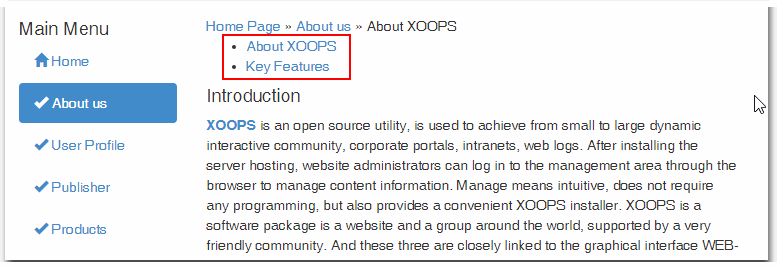
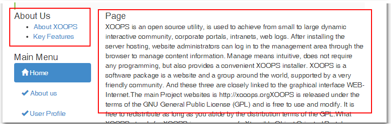

# 5.0 The User Side

The user is presented with About Us menu link, and when clicked, he will see links and the key page:

Of course, the number of links will depend on your setup.

You can also add Blocks, that will show either the links only, or the content of the Page:
