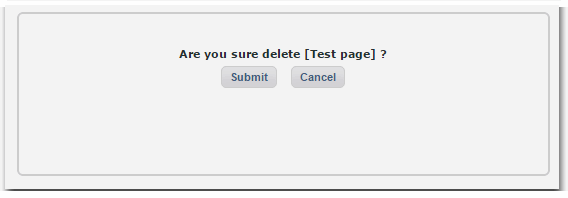

# Operating Instructions

## 4.1 Admin Home

When we visit the home page of the module management section, you can add, modify "About Us" pages, and you can specify the sort function in the settings page and home page.

 Reference Photos V1.0 admin1.1

The meaning of individual icons is described below:

| **Icon** |  **Description** |
| --- | --- |
|  | Published represents the interface can be displayed in the foreground |
|  | Representation stored in the draft does not appear in the front interface |
|  | Indicates that the internal link page |
|  | Represents external links page |
|  | Expressed not in the foreground appear in the menu interface |
|  | Denotes a display interface menu in the foreground |

Once you complete your About Us pages, the user might see something like this, as it is done in the default setting:

In front-end the user will see a menu with three options, and the right content \(Company\) and the menu options and no contact is displayed on the home page, which is a big advantage of this module, since you are in the background in the Company's "options menu is displayed in the" in the election of the "No", of course, if you want it displayed in the menu, click on "Yes" to everything is OK.

If you click on the "Key Features", you will see more information. It's also possible to add external links, which will lead you to another Website.

## 4.2 Page

The Page tab allows the administrator to add, modify, and delete related information pages.

### 4.2.1 Add Page

\(1\) Click "Add page" button to add a new page.

Fill out the required information.

You can set how the page is being displayed, if it is a stand-alone page, or if it is shown as sub-link to another page.

You can set the pop-up mode and the status of the page \(draft or published\).

\(2\) After you have finished adding information, click on the "Submit" button to save it. At this point you have successfully finished adding a page. You will see your page added in reference. After you have added you will be able to edit and delete pages.

### 2.2.2 Edit Page

\(1\) When we click the "Edit" link in the editor, XOOPS will open the form for you so you can edit the page:

\(2\) At this point you can make the appropriate changes. After modifying click "Submit" button to save your changes.

### 2.2.3 Delete page

Click the page that corresponds to the "Delete" → \(Figure V1.0 admin1.5\) prompt, and then pop up as shown in Figure V1.0 admin1.6,

Once you click on "Submit" the page will be permanently deleted. Of course, if you do not want to delete, click on the "Cancel" button.

## 2.3 External links

This page allows the administrator to add, modify related information of the external links page.

### 2.3.1 Add External links

\(1\) Click the "Add external links" button as shown above, and you'll get a form to fill out. Since the external link address is marked with a red asterisk, this field is required. You can also set the option if you want the link to open in a new window or the current one, and if this link is published, or if it is still off-line. 

\(2\) Click the "Submit" button, you will see external links page you added in reference to FIG V1.0 admin1.1 years.

### 2.3.2 Edit & Delete External links

The process is the same as for the regular pages, as shown above.

